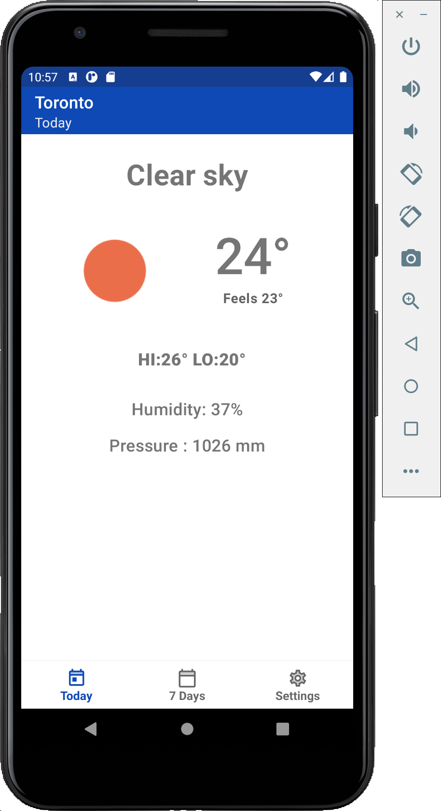
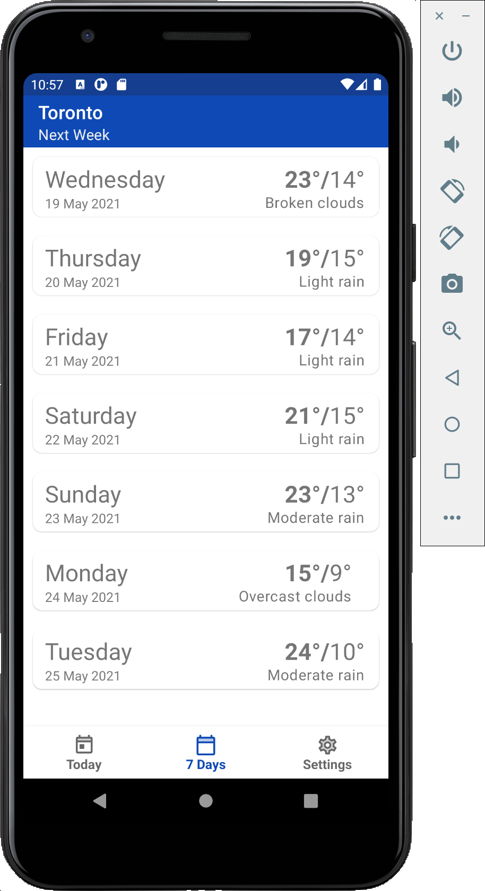
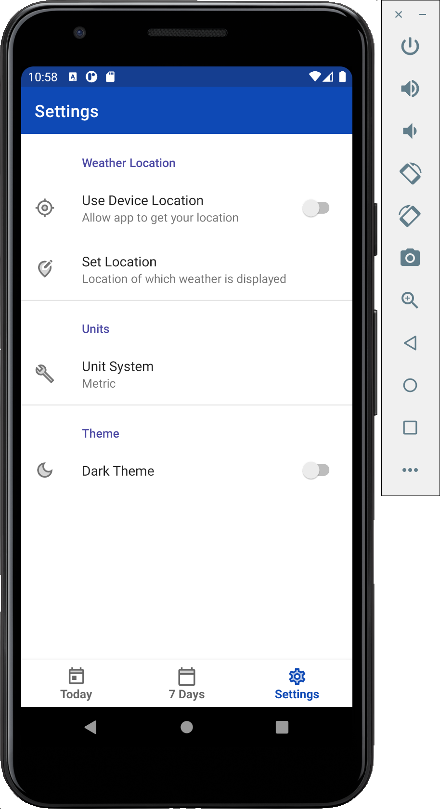
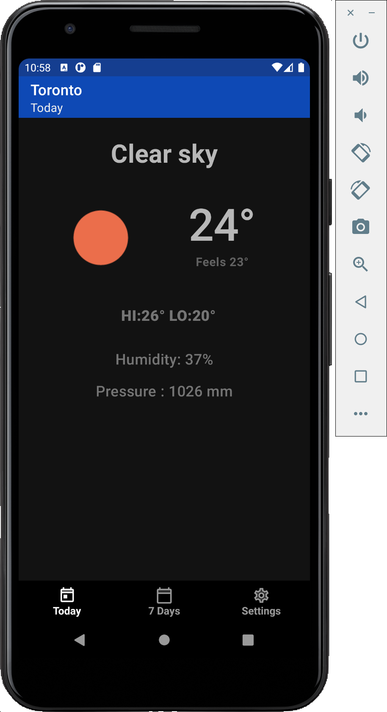
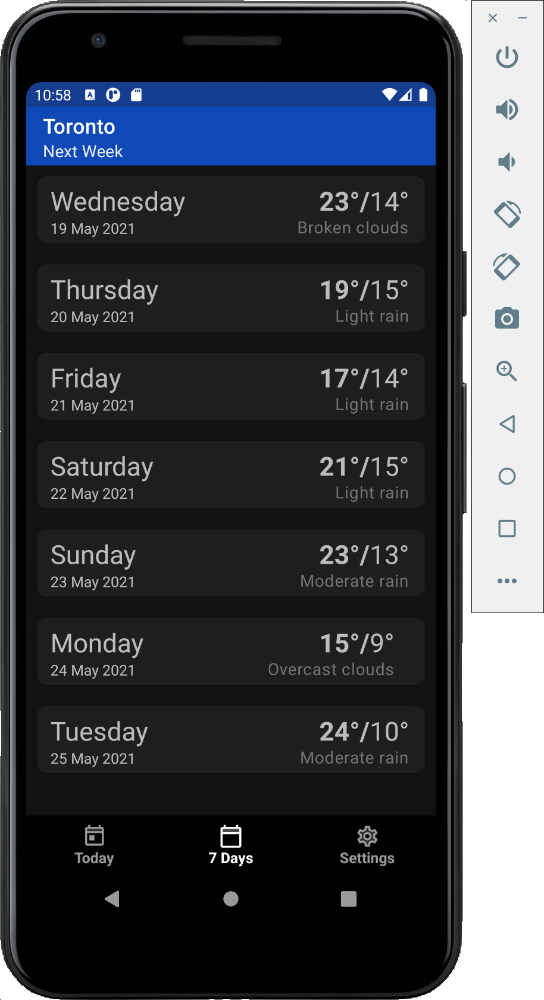
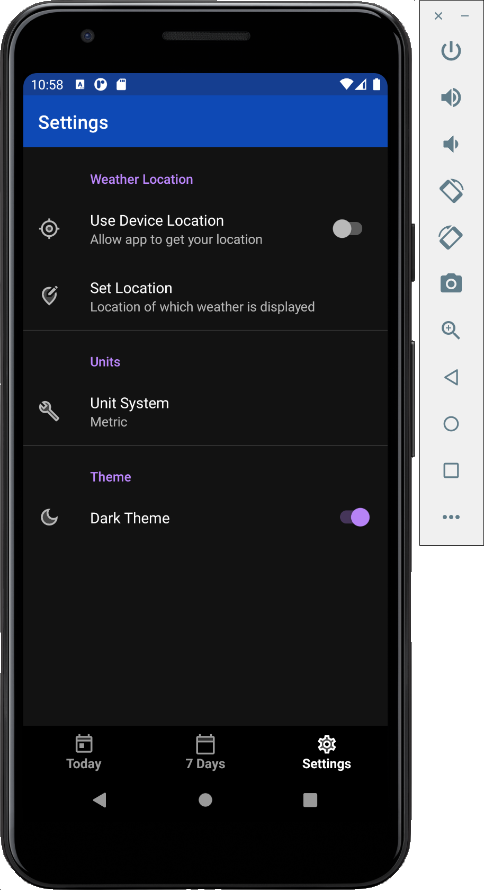

# findMyWeather App

A simple weather app built using OpenWeatherMap API and MVVM app architecture that displays current weather conditions as well as 7 day forecast. This app is also beautifully implemented for dark mode as well. This was my project for the university class of Android.  

## Screenshots
* Light Mode

  
 
 

* Dark Mode

  
 
 

## Features

* Shows current weather conditions
* Shows 7-day weather forecast
* Supports Metric/Imperail units
* Beautiful Light and Dark mode 
* Consistent use of built-in system icons throughout the UI

### Libraries used

1. Retrofit
2. GSON Converter
3. Room Database
4. Glide for Images from URL
5. Kodein Dependency Injection
6. Groupie 

 

